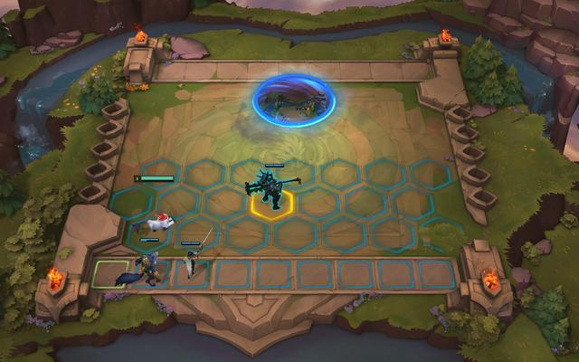

# TFT-Zero

<p align="center">
  
</p>

TFT-Zero is a compact research scaffold for testing **TFT-shaped strategic
planning** with fast simulation, legal action masks, Puffer-compatible batched
rollouts, and simulator-backed MCTS.

This repository is the submission landing page. The current report packet is:

- [Paper/report agent context](artifacts/paper_agent_context/README.md)

- [Paper draft](https://prism.openai.com/?u=db147769-d04d-4a0c-bd51-3123fc427703&pg=1&m=neurips_2026.tex&d=7)

## What This Shows

The active lane is a simplified, Markov, TFT-shaped simulator. It keeps the
strategic decisions that matter for a small planning experiment: leveling,
rolling, buying upgrades, fielding strongest board, economy, enemy pressure,
placement-shaped outcomes, and abstract item slams.

It is **not** a Riot-accurate TFT clone, a ranked-player claim, a current-patch
MetaTFT planner, or a completed MuZero system.

## Current Results

| Result | Evidence | Status |
| --- | ---: | --- |
| Legacy Puffer-compatible vector rollout speedup | `11.23x` over scalar strategic stepping | Saved artifact from pre-4.0 wrapper path |
| Scalar strategic throughput | `15,970` steps/sec | Claim-grade repo artifact |
| Batched strategic throughput | `179,414` steps/sec | Claim-grade repo artifact |
| PufferLib 4 Ocean-style standalone env | `~4.1M` steps/sec in commit smoke | Standalone C benchmark, not full trainer |
| Compiled simulator-backed MCTS throughput | `565k-606k` simulations/sec | Isolated worktree artifact |
| Compiled MCTS speedup vs Python MCTS | about `243x-255x` simulations/sec | Needs clean merge/promotion |
| MuZero-style cache rows | `128`, legal action rate `1.0` | Smoke artifact |
| Strategic action space | `11` legal-masked macro actions | Active scaffold |
| Heuristic calibration | mean placement proxy `6.656`, death rate `1.0` | Claim-grade repo artifact |
| Python MCTS smoke | `mcts_32` improves reward/scenario score, not placement | Smoke artifact |
| PPO strategic native smoke | `128` steps, one update | Wiring only |

The strongest current systems result is the compiled planning worktree:

```text
Python MCTS:  ~2.38k-2.44k simulations/sec
Native MCTS:  ~0.56M-0.61M simulations/sec
Speedup:      ~243x-255x
```

The strongest saved rollout artifact from the legacy Puffer-compatible vector
path is:

```text
Scalar strategic step path:   15,970 steps/sec
Batched native-vector path:   179,414 steps/sec
Speedup:                     11.23x
Semantic parity:             true
Decision:                    pass
```

The current dependency pin is PufferLib 4.0, where the old
`pufferlib.PufferEnv`/`pufferlib.emulation` wrapper API is gone. New live Puffer
work should use the Ocean-style C scaffold and benchmark command below.

## Main Artifacts

Paper/report handoff:

```text
artifacts/paper_agent_context/README.md
```

Strategic lane summary:

```text
artifacts/strategic_lane/metrics.json
artifacts/strategic_lane/final_report.md
artifacts/strategic_lane/decision.md
```

Puffer-compatible speed evidence:

```text
artifacts/strategic_lane/puffer_speed/metrics.json
artifacts/strategic_lane/puffer_speed/decision.md
```

MuZero-style cache smoke:

```text
artifacts/strategic_lane/muzero_cache/rows.jsonl
artifacts/strategic_lane/muzero_cache/metrics.json
artifacts/strategic_lane/muzero_cache/decision.md
```

Playable payload smoke:

```text
artifacts/strategic_lane/playable_demo/initial_payload.json
artifacts/strategic_lane/playable_demo/metrics.json
artifacts/strategic_lane/playable_demo/decision.md
```

PPO smoke:

```text
artifacts/strategic_lane/ppo_smoke/strategic_native_puffer_smoke.pt
artifacts/strategic_lane/ppo_smoke/strategic_native_puffer_smoke.manifest.json
```

Python simulator-backed MCTS smoke:

```text
artifacts/strategic_lane/mcts_smoke/metrics.json
artifacts/strategic_lane/mcts_smoke/paper_table.md
artifacts/strategic_lane/mcts_smoke/episodes.jsonl
artifacts/strategic_lane/mcts_smoke/decisions.jsonl
```

Compiled simulator-backed MCTS artifacts currently live in the isolated
worktree:

```text
/mnt/ssd2/Projects/TFT-zero-compiled-strategic-mcts/artifacts/strategic_lane/mcts_native_smoke/
/mnt/ssd2/Projects/TFT-zero-compiled-strategic-mcts/artifacts/strategic_lane/mcts_native_benchmark/
/mnt/ssd2/Projects/TFT-zero-compiled-strategic-mcts/artifacts/strategic_lane/mcts_python_matched_smoke/
```

## Code Map

Core strategic simulator:

```text
src/mini_tft/strategic/core/actions.py
src/mini_tft/strategic/core/state.py
src/mini_tft/strategic/core/rules.py
src/mini_tft/strategic/core/obs.py
```

Adapters:

```text
src/mini_tft/strategic/adapters/baselines/policies.py
src/mini_tft/strategic/adapters/puffer/vector_env.py
src/mini_tft/strategic/adapters/puffer/benchmark.py
src/mini_tft/strategic/adapters/muzero_cache/export.py
src/mini_tft/strategic/adapters/web_demo/payload.py
src/mini_tft/strategic/adapters/mcts.py
```

Training and CLI surfaces:

```text
src/mini_tft/rl/puffer_env.py
src/mini_tft/rl/train_puffer_ppo.py
src/mini_tft/tools/strategic_lane_gate.py
src/mini_tft/tools/strategic_mcts_smoke.py
```

## Reproduce Current Repo Evidence

Use `env -u UV_PYTHON uv run ...` for repo commands.

```bash
uv sync
env -u UV_PYTHON uv run pytest
env -u UV_PYTHON uv run ruff check
env -u UV_PYTHON uv run --all-extras pyright
```

Strategic lane gate:

```bash
env -u UV_PYTHON uv run python -m mini_tft.tools.strategic_lane_gate
```

Python MCTS smoke:

```bash
env -u UV_PYTHON uv run python -m mini_tft.tools.strategic_mcts_smoke \
  --out-dir artifacts/strategic_lane/mcts_smoke \
  --episodes 8 --simulations 8 16 32 \
  --max-depth 8 --rollout-steps 6 \
  --prior-mode heuristic --seed 9100
```

PufferLib 4 Ocean-style standalone smoke:

```bash
env -u UV_PYTHON uv run python -m mini_tft.tools.benchmark_puffer4_ocean \
  --envs 512 --steps 100000 \
  --out-dir artifacts/strategic_lane/puffer4_ocean_commit_smoke
```

Legacy native strategic Puffer PPO smoke requires a PufferLib version that still
exports `pufferlib.PufferEnv` and `pufferlib.emulation`. The saved artifact is:

```text
artifacts/strategic_lane/ppo_smoke/strategic_native_puffer_smoke.manifest.json
```

## PufferLib 4.0 Route

The current repo is pinned to PufferLib 4.0. The old
`PufferEnv`/emulation-compatible surface is no longer available, so the minimal
4.0 route is the Ocean/C scaffold copied from `ocean/squared`.

This repo now contains a standalone strategic Ocean-style scaffold:

```text
src/mini_tft/strategic/ocean/strategic_tft.h
src/mini_tft/strategic/ocean/strategic_tft.c
src/mini_tft/strategic/ocean/binding.c
config/strategic_tft.ini
src/mini_tft/tools/benchmark_puffer4_ocean.py
```

To build inside a full PufferLib 4.0 checkout:

```bash
git clone --branch 4.0 https://github.com/PufferAI/PufferLib.git ../TFT-zero-puffer4
cd ../TFT-zero-puffer4
mkdir -p ocean/strategic_tft
cp ../TFT-zero/src/mini_tft/strategic/ocean/strategic_tft.* ocean/strategic_tft/
cp ../TFT-zero/src/mini_tft/strategic/ocean/binding.c ocean/strategic_tft/
cp ../TFT-zero/config/strategic_tft.ini config/strategic_tft.ini
bash build.sh strategic_tft --local
```

Use the Python strategic simulator as the parity oracle before reporting any
full PufferLib 4.0 trainer numbers.

## Active Docs

- [Agent Notes](AGENTS.md): current rules for coding agents.
- [Architecture](docs/ARCHITECTURE.md): compact system map.
- [Strategic Lane](docs/STRATEGIC_LANE.md): clean simulator lane and deliverables.
- [Loop Scaffold](docs/LOOP_SCAFFOLD.md): repeatable autonomous loop contract.
- [Quality Gate](docs/QUALITY_GATE.md): deterministic verification criteria.
- [Training](docs/TRAINING.md): minimal PPO/Puffer/MuZero command surfaces.
- [Archive Index](docs/ARCHIVE_INDEX.md): where old runbooks and reports moved.

## Claim Rules

- Toy and strategic-lane results are simplified simulator results.
- `placement_proxy` is an elimination-timing bucket, not real TFT placement.
- Puffer-compatible speed is rollout-throughput evidence, not policy-quality
  evidence.
- Compiled MCTS speed is simulator-backed search throughput, not MuZero.
- MuZero claims require learned dynamics, model-backed search, legal masks,
  auditable cache rows, and deterministic baseline comparisons.
